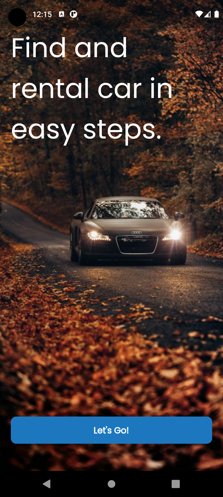
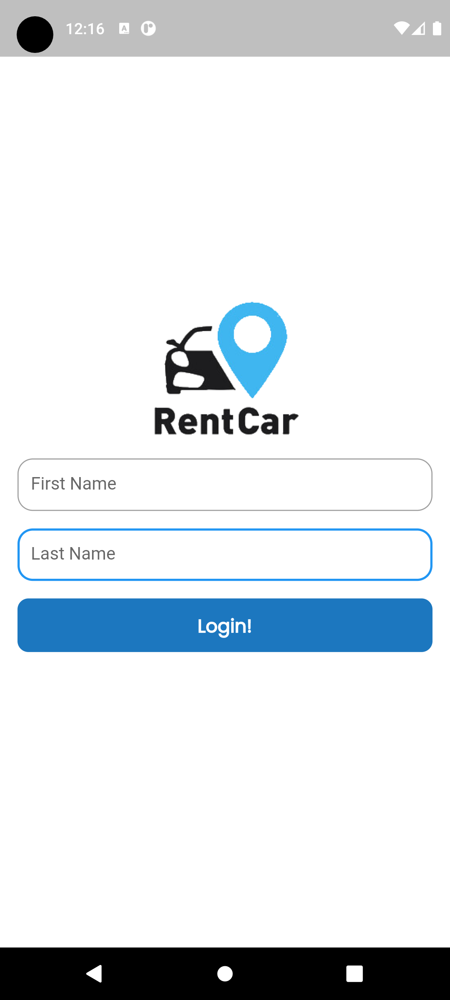
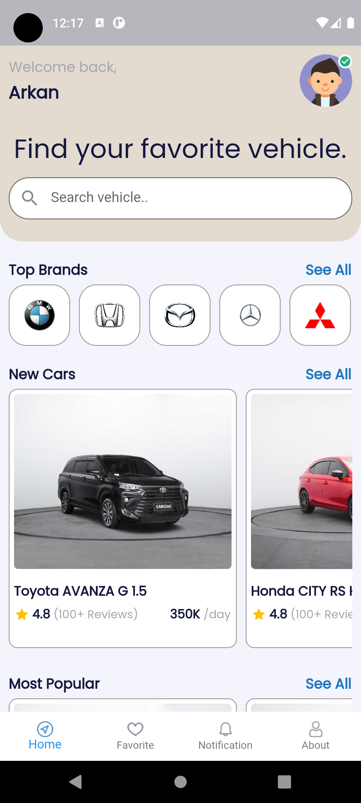
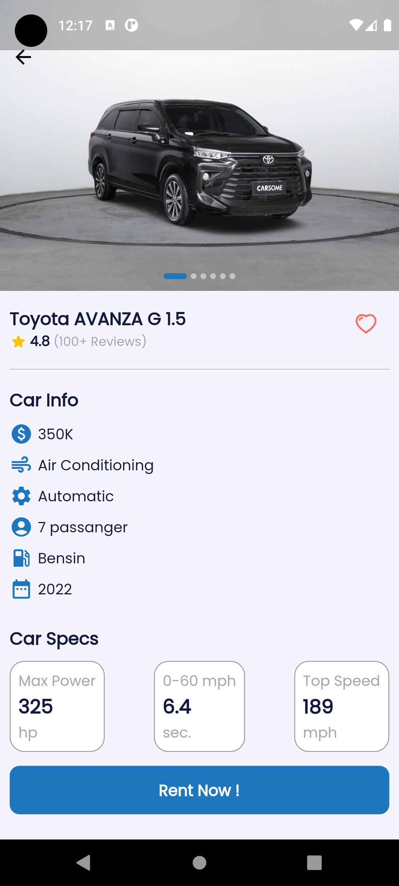

# rentcar_app

Submission Belajar Membuat Aplikasi Flutter untuk Pemula Dicoding

## Tampilan Aplikasi

    
    
    
    

### Informasi kelas
<b>Materi yang dipelajari:</b>
<ul>
    <li>Pengenalan Flutter : Mengenal tentang Flutter dan instalasi alat-alat yang dibutuhkan untuk pengembangan. (4 jam 50 menit)</li>
    <li>Dasar-Dasar Flutter : Mempelajari dasar-dasar dalam membuat aplikasi Flutter dan pengenalan tentang package manager. (1 jam 45 menit)</li>
    <li>Pengenalan Widget : Mengenal widget-widget dasar yang umum digunakan dalam Flutter, navigasi antar halaman, dan bagaimana menambahkan aset serta gambar. (16 jam 40 menit)</li>
    <li>Deployment : Mampu melakukan build aplikasi Flutter ke dalam bentuk berkas APK, AAB, dan folder web. (1 jam 45 menit)</li>
</ul>
